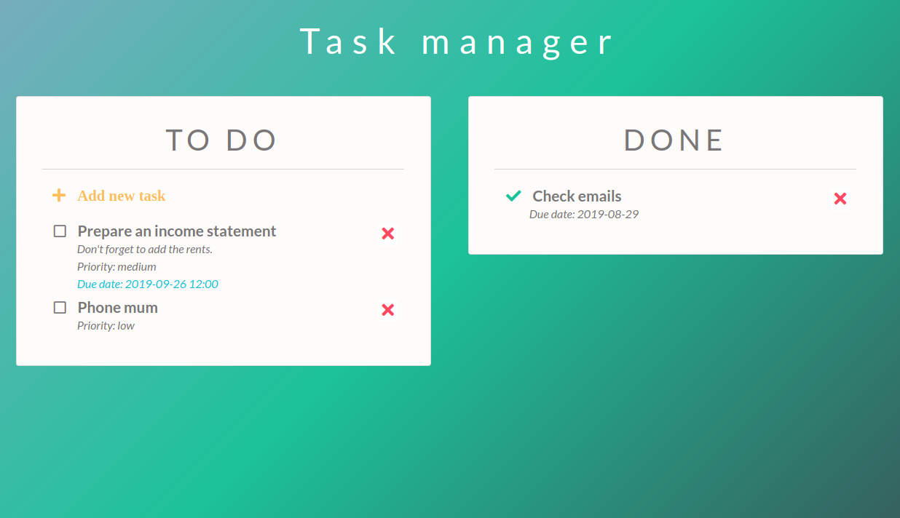

## TO-DO REACT

<p align="center">
  
</p>

This schedule manager is my first project made with Bootstrap classes and React. It's easy to add or delete tasks that will remain sorted by date and time, showing always the most near first.

### **Features**

- There is a button to add a task that shows a form to fill.
- In the form, only the title is required, if it isn't filled, a message in red will appear.
- When the form is validated, a to-do task is added at the left side.
- The tasks are shown sorted by date and time.
- When a task is finished, you can mark it as done, and the task will move to the done side.
- If a to-do task is checked as done by error, it's possible to revert the movement.
- Otherside, every task can be deleted at every time.
- When the page is reloaded, the current taks will remain.

### **What I learned**

- Build a project with Classes and Components in React.
- Import and export Modules in JS.
- Validate datas from a form.
- Generate unique identifies with UUID.
- Manage the state dynamically.
- Pass properties between Components.
- Store dates in LocalStorage and update the state.
- Documentate the App with PropTypes.
- Deploy the project to production in Github pages throught a branch.

### **Resources**

- To generate unique identifies I have used [UUID](https://www.npmjs.com/package/uuid), a package from NPM.
- Bootstrap styles with (Bootswatch)[https://bootswatch.com/]
- This project was bootstrapped with [Create React App](https://github.com/facebook/create-react-app), from Facebook.


### **Usage**

To run the game in local, I have included Serve, a local server from an NPM library.

- Install Node.js at the terminal if you haven't yet (https://nodejs.org/es/). Commands for Ubuntu:

```bash
sudo apt-get update
sudo apt-get install nodejs
```
- You will need to install the package manager npm:

```bash
sudo apt-get install npm
```
- Clone or download the repository in your computer.

```bash
git clone https://github.com/diana-moreno/schedule-react.git`
```
- Download the npm competitions in your own repository and start it.

```bash
npm install
npm start
```

- Otherside, you can run the final project here: https://diana-moreno.github.io/todo-react/


### Available Scripts

In the project directory, you can run:

#### `npm start`

Runs the app in the development mode.<br>
Open [http://localhost:3000](http://localhost:3000) to view it in the browser.

The page will reload if you make edits.<br>
You will also see any lint errors in the console.

#### `npm test`

Launches the test runner in the interactive watch mode.<br>
See the section about [running tests](https://facebook.github.io/create-react-app/docs/running-tests) for more information.

#### `npm run build`

Builds the app for production to the `build` folder.<br>
It correctly bundles React in production mode and optimizes the build for the best performance.

The build is minified and the filenames include the hashes.<br>
Your app is ready to be deployed!

See the section about [deployment](https://facebook.github.io/create-react-app/docs/deployment) for more information.

#### `npm run eject`

**Note: this is a one-way operation. Once you `eject`, you can’t go back!**

If you aren’t satisfied with the build tool and configuration choices, you can `eject` at any time. This command will remove the single build dependency from your project.

Instead, it will copy all the configuration files and the transitive dependencies (Webpack, Babel, ESLint, etc) right into your project so you have full control over them. All of the commands except `eject` will still work, but they will point to the copied scripts so you can tweak them. At this point you’re on your own.

You don’t have to ever use `eject`. The curated feature set is suitable for small and middle deployments, and you shouldn’t feel obligated to use this feature. However we understand that this tool wouldn’t be useful if you couldn’t customize it when you are ready for it.


### More

#### Learn More

You can learn more in the [Create React App documentation](https://facebook.github.io/create-react-app/docs/getting-started).

To learn React, check out the [React documentation](https://reactjs.org/).

#### Code Splitting

This section has moved here: https://facebook.github.io/create-react-app/docs/code-splitting

#### Analyzing the Bundle Size

This section has moved here: https://facebook.github.io/create-react-app/docs/analyzing-the-bundle-size

#### Making a Progressive Web App

This section has moved here: https://facebook.github.io/create-react-app/docs/making-a-progressive-web-app

#### Advanced Configuration

This section has moved here: https://facebook.github.io/create-react-app/docs/advanced-configuration

#### Deployment

This section has moved here: https://facebook.github.io/create-react-app/docs/deployment

#### `npm run build` fails to minify

This section has moved here: https://facebook.github.io/create-react-app/docs/troubleshooting#npm-run-build-fails-to-minify
